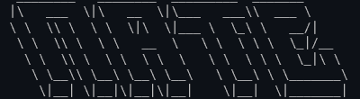

<div align="center">

<p align="center">
  
</p>

<p align="center">
  
</p>

Student at QUT (Queensland University of Technology), <br> studying Bachelor of Information Technology (Computer Science).

<!--START_SECTION:waka-->

```rust
From: 17 April 2026 - To: 17 April 2026

Total Time: 0 secs

No activity tracked
```

<!--END_SECTION:waka-->

#

### Socials:
[](https://linkedin.com/in/nate-p22)

### Primary Stack:
[]()

### Tools:
[]()

### Familiar With:
[]()

### Currently Learning:
[]()

### IDE's:
[]()

### GitHub Stats:
[]()

---
