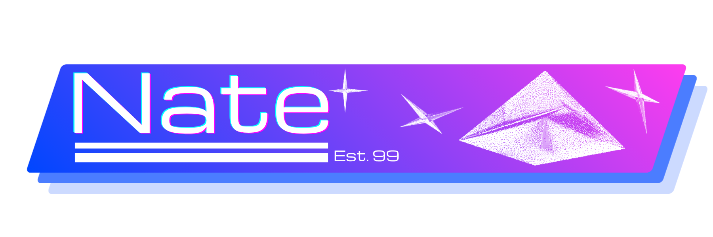
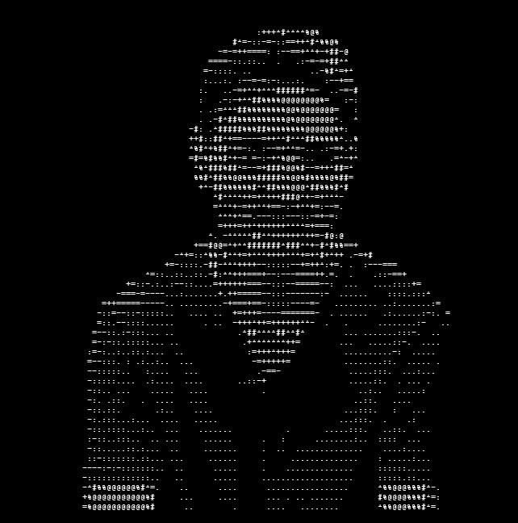

<p align="center"> 
            
</p>

<p align="center">
    
</p>

<p align="center">
    Student at QUT (Queensland University of Technology), <br>studying Bachelor of Information Technology (Computer Science).   
</p>

<!--START_SECTION:waka-->

```rust
From: 17 April 2026 - To: 18 April 2026

Total Time: 14 mins

Markdown   14 mins               >>>>>>>>>>>>>>>>>>>>>>>>>   100.00 %
```

<!--END_SECTION:waka-->

#

### Socials:

[](https://linkedin.com/in/nate-p22)

### Primary Stack:

[]()

### Tools:

[]()

### Familiar With:

[]()

### Currently Learning:

[]()

### IDE's:

[]()

---
